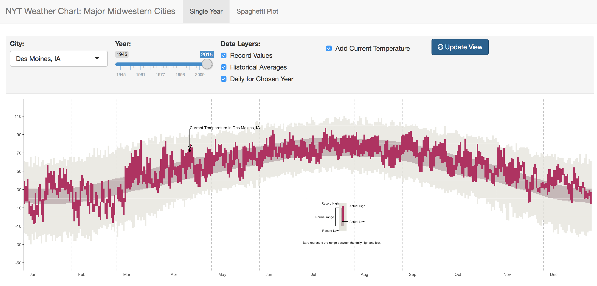

```{r, echo = FALSE}
# Notes:
# - Some years there are missing values, they are replacing missing values with 0degreesF; 
#       we will address this in the future work section unless we have time to deal with it before we present
# - Why don't we just start at 1950 since all cities are started by then. Easier then changing where we start for each different city
#
#
#
#
#
```


\section{Introduction}  

\section{Methods}  
```{r, echo = FALSE, message = FALSE, warning = FALSE}
# installing ish
library(tidyverse)
library(gridExtra)
temps <- read.csv(file = "./raw-data/DSM_temps.csv")
#head(temps)
dates_2016 <- gsub(pattern = "-", replacement = "/", x = seq(from = as.Date("2016-01-01"), 
                                                                  to = as.Date("2016-12-31"), by = "days"))
temps <- temps %>% select(-X) %>% mutate(date_2016 = lubridate::ymd(paste("2016", month, day, sep = "-")))
```

```{r, echo = FALSE, message = FALSE, warning = FALSE}

### BASE ###
base <- temps %>% ggplot(aes(x = date_2016)) + 
  theme_classic() +
  theme(panel.grid.major.x = element_line(colour = c("black", rep("grey", times = 11)), linetype = c(0, rep(2, times = 11))),
        axis.text.x = element_text(hjust = -0.9), 
        axis.line.x = element_blank(),
        axis.ticks.x = element_blank(),
        axis.line.y = element_line(colour = "darkgrey")) +
  scale_x_date(date_breaks = "1 month", 
               date_labels = "%b", 
               expand=c(0,0)) + 
  scale_y_continuous(breaks = seq(-20, 120, by = 20), limits= c(-40, 120)) + 
  xlab("") +
  ylab("")

text_layer_description <- annotate("text", 
                                   label = "Bars represent the range between the daily high and low.",
                                   x = lubridate::ymd("2016-07-24"),
                                   y = -28, hjust = "center", size = 2.3)

base <- base + text_layer_description

### RECORD ###
data_record <- temps %>% select(-date, -year) %>% 
  filter(actual_ave_rec == "Record", mean_max_min != "Mean Temperature") %>% 
  group_by(month, day) %>% spread(key = mean_max_min, value = value)
  
layer_record <- geom_rect(data = data_record, aes(xmin = date_2016, xmax = date_2016+1, ymin = data_record$`Min Temperature`, ymax = data_record$`Max Temperature`), fill = "#E6E5DD", alpha = 0.8)

legend_layer_record <- geom_rect(aes(xmin = lubridate::ymd("2016-07-22"), 
                                     xmax =  lubridate::ymd("2016-07-27"), 
                                     ymin = -15, 
                                     ymax = 15), 
                                 fill = "#E6E5DD", alpha = 0.8)
text_layer_record <-  annotate("text",
                               label = c("Record Low", "Record High"), 
                               x =  c(lubridate::ymd("2016-07-22"), lubridate::ymd("2016-07-22")), 
                               y = c(-15, 15), 
                               hjust = "right", 
                               size = 2.3)

records_plot <- base + 
  layer_record + legend_layer_record + text_layer_record


### AVERAGES ###
data_average <- temps %>% select(-date, -year) %>% 
  filter(actual_ave_rec == "Historical Average", mean_max_min != "Mean Temperature") %>% 
  group_by(month, day) %>% spread(key = mean_max_min, value = value)
  
layer_average <- geom_rect(data = data_average, aes(xmin = date_2016, xmax = date_2016+1, 
                                                   ymin = data_average$`Min Temperature`, ymax = data_average$`Max Temperature`), 
                           fill = "#BCACAC", alpha = 0.8)

legend_layer_average <- geom_rect(aes(xmin = lubridate::ymd("2016-07-24")-0.5, 
                                     xmax =  lubridate::ymd("2016-07-25")+0.5, 
                                     ymin = -10, 
                                     ymax = 10), 
                                 fill = "#BCACAC", alpha = 0.8)

text_layer_average <-  annotate("text",
                                label = "Normal range", 
                                x =  lubridate::ymd("2016-07-19"), 
                                y = 0, 
                                hjust = "right", 
                                size = 2.3)

line_layer_average_ver <- geom_segment(aes(x = lubridate::ymd("2016-07-20"), 
                                       xend = lubridate::ymd("2016-07-20"), 
                                       y = -10, 
                                       yend = 10), 
                                   size = 0.01)

line_layer_average_hor1 <- geom_segment(aes(x = lubridate::ymd("2016-07-20"),
                   xend = lubridate::ymd("2016-07-22"),
                   y = 10,
                   yend = 10),
               size = 0.01)

line_layer_average_hor2 <- geom_segment(aes(x = lubridate::ymd("2016-07-20"),
                   xend = lubridate::ymd("2016-07-22"),
                   y = -10,
                   yend = -10),
               size = 0.01)

records_averages_plot <- records_plot + layer_average + 
  legend_layer_average + text_layer_average + 
  line_layer_average_ver + line_layer_average_hor1 + line_layer_average_hor2
  
### ACTUAL ###
data_actual <- temps %>% 
  filter(actual_ave_rec == "Actual", year == 2015) %>% 
  group_by(month, day) %>% spread(key = mean_max_min, value = value)
  
layer_actual <- geom_rect(data = data_actual, aes(xmin = date_2016-.5, xmax = date_2016+.5, 
                                                   ymin = data_actual$`Min Temperature`, ymax = data_actual$`Max Temperature`), 
                           fill = "maroon")
layer_white_ylines <- geom_hline(yintercept = seq(-20, 100, by = 20), colour = "white", lwd = 0.1)


legend_layer_actual <- geom_rect(aes(xmin = lubridate::ymd("2016-07-24")-0.05, 
                                     xmax =  lubridate::ymd("2016-07-25")+0.15, 
                                     ymin = -5, 
                                     ymax = 12), 
                                 fill = "maroon")


text_layer_actual <-  annotate("text",
                               label = c("Actual Low", "Actual High"), 
                               x =  c(lubridate::ymd("2016-07-29"), lubridate::ymd("2016-07-29")), 
                               y = c(-5, 12), 
                               hjust = "left", 
                               size = 2.3)

line_layer_actual_hor1 <- geom_segment(aes(x = lubridate::ymd("2016-07-24"),
                   xend = lubridate::ymd("2016-07-28"),
                   y = -5,
                   yend = -5),
               size = 0.01)

line_layer_actual_hor2 <- geom_segment(aes(x = lubridate::ymd("2016-07-24"),
                   xend = lubridate::ymd("2016-07-28"),
                   y = 12,
                   yend = 12),
               size = 0.01)


#actual_plot <- base + layer_actual + legend_layer_actual + text_layer_actual + line_layer_actual_hor1 + line_layer_actual_hor2

all_plot <- records_plot + 
  layer_average + 
  legend_layer_average + text_layer_average + 
  line_layer_average_ver + line_layer_average_hor1 + line_layer_average_hor2 + 
  layer_white_ylines +
  layer_actual + legend_layer_actual + text_layer_actual + line_layer_actual_hor1 + line_layer_actual_hor2

```


```{r, echo = FALSE, message = FALSE, warning = FALSE, fig.width = 12, fig.height = 5, fig.cap = "The static visual at each of the individual steps, as layers were created and added to the chart."}

base1 <- base + labs(title = "Step 1: Creating a base")
records_plot1 <- records_plot + labs(title = "Step 2: Adding the record values")
records_averages_plot1 <- records_averages_plot + labs(title = "Step 3: Adding historical averages")
all_plot1 <- all_plot + labs(title = "Step 4: Adding daily temperature values for 2015")
grid.arrange(base1, records_plot1, records_averages_plot1, all_plot1, ncol = 2)
```

\subsection{Scraping the Data}  

Our first step in recreating The New York Times interactive weather chart was scraping the data from the web. We decided to scrape our data from [Weather Underground](https://www.wunderground.com/). This site is a weather web service that provides real-time and historical weather information. The majority of their weather data comes from 1602 stations operating at airports across the US. For this project, we scraped temperature data for 10 cities in the Midwest: Chicago, Columbus, Des Moines, Detroit, Fargo, Madison, Minneapolis, Omaha, Sioux Falls, and St. Louis. 

We decided to scrape our data from Weather Underground because they supplied the necessary temperature data that we would need to recreate The New York Times chart in a refined table for multiple cities across the US. Along with that, the url was easy to update in a function according to year and city. Figure 1 is a screen shot for the webpage of Des Moines, IA for January 1, 2015. The url for this webpage is https://www.wunderground.com/history/airport/KDSM/2015/1/1/DailyHistory.html. In this url, "KDSM" indicates the Des Moines airport. Following that is the year, month, and date. These are the only segments of the url that change according to specified cities (i.e. airports) and days.  


For each city, two functions were run to scrape the data. The first function scraped the daily actual mean, maximum, and minimum temperatures. On the Weather Underground webpage, this is the *Actual* column seen in Figure 1. The maximum and minimum daily actual temperatures would later become the lower and upper bounds of the daily temperature layer on our graphic. Daily temperatures were scraped for each day starting on January 1, 1950 and ending on March 31, 2017. The second function scraped the historical average mean, maximum, and minimum temperatures as well as the record maximum and minimum for each day. The record years were also recorded with the record maximum and minimum. On the Weather Underground webpage, this is the *Average* and *Record* columns seen in Figure 1. The reason behind using two functions to scrape the data was due to efficiency. The historical averages and daily records only needed to be scraped for one year (366 days) while the daily actual temperatures needed to be scraped for all years (over 24,000 days). 

Along with the historic temperature data, our Shiny app scrapes the current temperature given by Weather Underground for a specified city. This app will be described in later sections. This tempurature then becomes a point on our final graphic. As an example, the current temperature for Des Moines can be scraped from https://www.wunderground.com/US/IA/Des_Moines.html. By changing the state and city in this url, we can scrape the current temperature for any city that Weather Underground reports. 
  
Web scraping was the most time consuming step of our project. It took approximately 7-8 hours to run our two functions that scrape the historical temperature data for each city. This is one of the main reasons why we only scraped data for 10 cities. If we had the time and computing power, we would like to have created our functions to input a vector of all 1602 Weather Underground airport codes and output one large data frame. If this were the case, we would most likely have to switch to a different software other than R.  

\subsection{Creating a Static Visual}  

After data collection we were able to begin building our static recreation of the New York Times weather chart. We made this first static visual using the historic records, averages, and daily temperatures for the city of Des Moines, IA. We created this chart for the year 2015 because at the time the New York Times had a 2015 weather chart for various cities available on their website and we were able to compare our results directly. In anticipation of the flexiblilty that would be required to allow future users to choose a combination of layers to be plotted in a Shiny app, we created the static visual as a base plot with many layers that could be easily placed together to produce many variations of the original chart.

The base of the plot included the axes, theme, and legend that would remain constant regardless of which layers were placed on top. The theme and major gridlines were chosen to match the orignal chart as closely as possible and the y-axis limits were set to accomodate a large range of record temperatures for midwestern cities. Each of the dates on the x-axis of the base layer were plotted for the year 2016 because it includes a leap year and all historic averages and records were scraped from the most recent completed year (2016). Thus, regardless of which year the user may choose to plot, leap day averages and records will appear even if a daily temperature is not available.   

The remainder of the chart was simply built by creating three layers containing seperate visuals of the historic records, averages, and daily temperatures and adding these visuals as layers to the base plot in a particular order. The first layer to be added to the base of the chart was for the historic records. This layer was created by graphing bars that spanned from the record low temperature to the record high temperature for each day over the course of one year. A matching legend was added to the layer and would show up whenever the layer was present on the plot. The next layer was constructed using bars, this time spanning from the average low to the average high temperature for each calendar day, averaged accross all years. This layer also included its own matching portion of legend that would plot whenever this layer was present. The final layer was created in a similar fashion to include boxes spanning from the daily high and low temperatures for each calendar day in 2015. This was the top layer and added the final data visual to the plot as well as the final piece of the legend. Along with this layer we also added faint white y-axis gridlines underneath it that would cross over the previous two layers and act as a reference point for viewers.  

\subsection{Introducing Shiny Interactivity}  
\subsubsection{Classic Chart Recreation for a Single Year}

The New York Times weather chart allows users to select a city from a drop down menu and view dail temperatures for the year 2015 along with recoreds and averages. We wanted to keep this useful peice of interactivity and so our users can too chose a city to view from a drop down menu. As already discussed in the scraping section, we have a limited scope of cities. When a user choses one of the midwestern cities from the menu, the data is filtered to include temperatures for that city only.

Next, we wanted to implement an interactive option that wasn't available on the NYT weather chart. We thought that by allowing users to view daily temperatures for a large range of years, not just for 2015 would be a large improvement. Some of the cities that we scraped data for have daily temperature data ranging all the way back to 1945, but unfortunately the full set of cities we are working with do not agree on this start date. All of the cities do have daily temperatures beyond 1950, so we chose to make this element of the interactivity available to users only for the years 1950 to 2016 in the form of a slider bar. Since the chart spans a full year, we do not include 2017 in the 'Single Year' tab of our Shiny app. Users can view data for the current year in the other tab, explained in Section 2.3.2. 

When users select a single year, they are dictating the set of daily temperatures that will be filtered from the data and plotted in the top layer of the graphic. It is important to note that the record and historical averages layers will not change for any given city, no matter which year is selected. These are record values that are current through March 2017, either averaged with data from the current year (for average data), or updated when a record temperature occurs.

Additionally, we decided to allow the user to select which layers of the visual they would like to view together. The base layer and gridlines will remain constant, and as users check boxes to select which layers they want to examine, the layers are added or removed from this base plot accordingly. No matter which order the boxes are checked in, layers will always be added in the order they are meant to be in the original chart (i.e., records on the bottom, then averages, and finally the daily temperatures on top). This interactivity was made possible by a reactive function that creates seven plots of each possible layer combination for the city-year pair, and returns the one that matches the boxes that the user has checked.  


\subsubsection{Spaghetti Plot for Many Years}


While the original chart recreation in the 'Single Year' tab is very informative and flexible, it only allows users to inspect a single year at a time. We thought it would be nice if the user could compare temperature data for a single city over many years in one place so we created a spaghetti plot feature that resides in the 'Spaghetti Plot' tab of the Shiny app. 

Again, users are able to choose a city to investigate from a drop down menu. For the chosen city, the spaghetti plot is constructed with temperatures on the y-axis and month-day on the x-axis. Data is added to the chart by plotting a line through the average daily temperatures over the course of one year for each year. Lines for the years 1950 through 2015 are grey while the lines for 2016 and 2017 are colored so that the user is able to quickly see recent weather patterns and how they relate to previous years for a single city. 

\section{Outcomes}  

In the 'Single Year' tab of the Shiny app, users can interact with our recreation of the original chart (see Figure 2). Although we have a much smaller set of cities in our Shiny app we wanted to include much of the same interactivity that the New York Times implemented, and extend to add a few new ways that users could interact with the data.  

The largest and most straight forward update that we wanted to include was the ability for users to choose which year to display daily temperatures for. The original graphic has many other impressive details, but the ability to view temperatures for a range of years will be a great advantage when investigating how weather trends change. Users of the app can select which year they want to look at by moving a slider input across a variety of years and the app reacts accordinly to change the top layer to reflect current temperatures for the chosen year.

What we might deem the most innovative update to the interactive version of the original chart is the flexibility and variety of viewing options that are available to the user. Our app allows the user to look at any of the three layers individually, or any combination of the three layers. This allows them to see the full graphic that resembles the original New York Times chart (as in Figure 2), or just examine a single aspect of the data for a specified city and year. 



In the 'Spaghetti Plot' tab the user can view average trends for a single city over multiple years in one plot. This is advantagous to a user who is interested in assessing and comparing average weather trends for a city over many years. Additionally this plot includes data for the year 2017, which the single year plot does not. In order to show the user what average temperatures have been doing lately, we highlight the latest complete year (2016) and the current incomplete year (2017).


\section{Discussion}  

\section{Future Work}  

Although we believe this project has allowed us to successfully recreate an iconic weather chart and implement new interactive elements, there are still many improvements that could be made to this project. There are several elements of the New York Times interactive graphic that we did not include in ours; the cumulative precipitation chart for each month, the average temperature for the year and how it compares to historic averages, and the ability to switch the scale to Celsius instead of Fahrenheit.  

Although it would require a lot of extra time to scrape precipitation data, we believe this would be a useful addition to the chart if time allowed. The Weather Underground does not include snow in their precipitation totals, so we would have to also take that into consideration when adding that new element to the chart, especially since our current cities are all in regions that have snowfall each winter.   

In the top left corner of the original graphic, there is a note about what the year's average temperature was in that city, and how much higher or lower that overall average was than the historic average. As that was the focus of their chart on the interactive chart page, ``How Much Warmer Was Your City in 2015", it is difficult for statisticians to reconcile one overall average temperature for the entire year without any further explanation, especially for cities in which winter temperatures greatly vary from summer temperatures. We would like to explore other options to communicate this information, and perhaps find a more accurate or detailed way to display it to viewers.  

Although it would simply require a change in the axes and a transformation of the data, we did not create the option for users to change between Celsius and Fahrenheit. With all the other options available to users, it would be a bit clunky to also add in that transformation.  

The biggest roadblock for a lot of these issues is the code that we are working with. Scraping the data takes quite a while, because we have to open a link separately for each day we want data for in history. However, if we could find a quicker way to scrape this data, we would be very interested in expanding the scope of cities we have data for so that users have even more to work with. The framework we have set up for the Shiny interactivity also means that a lot of things have to happen to our data inside the app itself before we can display the image that the user would like to see; once we filter the data by city and year, the graphics themselves have to be created and then displayed based on which layers the user is interested in. If we could find a way to render much of this information outside of the 'reactive' statement or a better way to do it in general, we would be able to have more options and they would render more quickly.  

Finally, we would like to be able to add some interactivity with the `plotly` package, or at least be able to denote record temperatures that happen in a given year when they occur. The original chart denotes when record values happen and labels them with what the value of that record temperature was. If we could allow users to be able to scroll over the values for the current year, they could see what the actual values were that make up the different layers. However, as it stands at the moment, when `plotly` is added to the graphic, it is extremely slow and takes approximately 1 minute to render a single plot. This is clearly an unreasonable amount of time for a user to wait for an image, especially if they want to switch around layers quickly.  

Although we have not created an actual R package, we believe it would be a really fun interactive environment for users to look into, as well as for professors to use as teaching material - either about `ggplot2`, `shiny`, or just about interactive graphics in general. It may be advantageous to have this as a full R package available at least via GitHub, and let users know what they can do with the available data and the shiny app.  