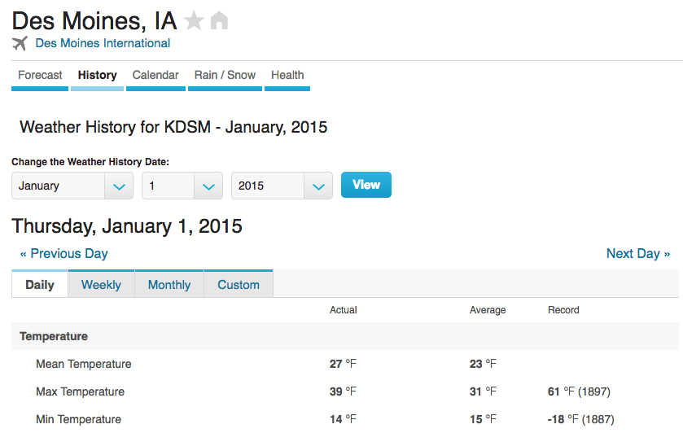
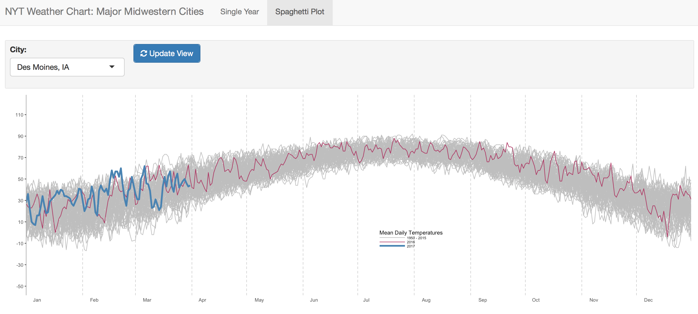

```{r, echo = FALSE}
# Notes:
# - Some years there are missing values, they are replacing missing values with 0degreesF; 
#       we will address this in the future work section unless we have time to deal with it before we present
# - Why don't we just start at 1950 since all cities are started by then. Easier then changing where we start for each different city
#
#
#
#
#
```


\section{Introduction}  
In recent years, there has been an explosion in the use of interactive graphics and interactive data visualization, especially in the field of journalism. More and more media sources are making use of creative ways to present information to viewers that allows them to explore the world around them. The ability to interact with these graphics allows for a powerful learning experience. The New York Times' _The Upshot_ has been on the forefront of this vast field of exploration, as they not only have been presenting new and exciting static graphics for many decades in print, but have now expanded heavily into the world of user interaction. One of the quintissential examples of this user interaction is their "How Much Warmer Was Your City in 2015" interactive graphic, based on the classic 1979 New York Times Weather Chart.  

As the framework for creating interactive graphics in `R` has expanded as well, statisticians and data scientists now have the ability to create some of these same powerfully interactive graphics. In fact, Amanda Cox of _The Upshot_ actually uses `R` to sketch out some of her graphics before implementing them using the `d3` library.    


With the tools we have learned in Stat 585X, we can showcase these new abilities in `R` by scraping the weather data, recreating that quintissential chart, and creating a user-friendly interactive app using `shiny`.  

\section{Methods}  
```{r, echo = FALSE, message = FALSE, warning = FALSE}
# installing ish
library(tidyverse)
library(gridExtra)
temps <- read.csv(file = "./raw-data/DSM_temps.csv")
#head(temps)
dates_2016 <- gsub(pattern = "-", replacement = "/", x = seq(from = as.Date("2016-01-01"), 
                                                                  to = as.Date("2016-12-31"), by = "days"))
temps <- temps %>% select(-X) %>% mutate(date_2016 = lubridate::ymd(paste("2016", month, day, sep = "-")))
```

```{r, echo = FALSE, message = FALSE, warning = FALSE}

### BASE ###
base <- temps %>% ggplot(aes(x = date_2016)) + 
  theme_classic() +
  theme(panel.grid.major.x = element_line(colour = c("black", rep("grey", times = 11)), linetype = c(0, rep(2, times = 11))),
        axis.text.x = element_text(hjust = -0.9), 
        axis.line.x = element_blank(),
        axis.ticks.x = element_blank(),
        axis.line.y = element_line(colour = "darkgrey")) +
  scale_x_date(date_breaks = "1 month", 
               date_labels = "%b", 
               expand=c(0,0)) + 
  scale_y_continuous(breaks = seq(-20, 120, by = 20), limits= c(-40, 120)) + 
  xlab("") +
  ylab("")

text_layer_description <- annotate("text", 
                                   label = "Bars represent the range between the daily high and low.",
                                   x = lubridate::ymd("2016-07-24"),
                                   y = -28, hjust = "center", size = 2.3)

base <- base + text_layer_description

### RECORD ###
data_record <- temps %>% select(-date, -year) %>% 
  filter(actual_ave_rec == "Record", mean_max_min != "Mean Temperature") %>% 
  group_by(month, day) %>% spread(key = mean_max_min, value = value)
  
layer_record <- geom_rect(data = data_record, aes(xmin = date_2016, xmax = date_2016+1, ymin = data_record$`Min Temperature`, ymax = data_record$`Max Temperature`), fill = "#E6E5DD", alpha = 0.8)

legend_layer_record <- geom_rect(aes(xmin = lubridate::ymd("2016-07-22"), 
                                     xmax =  lubridate::ymd("2016-07-27"), 
                                     ymin = -15, 
                                     ymax = 15), 
                                 fill = "#E6E5DD", alpha = 0.8)
text_layer_record <-  annotate("text",
                               label = c("Record Low", "Record High"), 
                               x =  c(lubridate::ymd("2016-07-22"), lubridate::ymd("2016-07-22")), 
                               y = c(-15, 15), 
                               hjust = "right", 
                               size = 2.3)

records_plot <- base + 
  layer_record + legend_layer_record + text_layer_record


### AVERAGES ###
data_average <- temps %>% select(-date, -year) %>% 
  filter(actual_ave_rec == "Historical Average", mean_max_min != "Mean Temperature") %>% 
  group_by(month, day) %>% spread(key = mean_max_min, value = value)
  
layer_average <- geom_rect(data = data_average, aes(xmin = date_2016, xmax = date_2016+1, 
                                                   ymin = data_average$`Min Temperature`, ymax = data_average$`Max Temperature`), 
                           fill = "#BCACAC", alpha = 0.8)

legend_layer_average <- geom_rect(aes(xmin = lubridate::ymd("2016-07-24")-0.5, 
                                     xmax =  lubridate::ymd("2016-07-25")+0.5, 
                                     ymin = -10, 
                                     ymax = 10), 
                                 fill = "#BCACAC", alpha = 0.8)

text_layer_average <-  annotate("text",
                                label = "Range of Historical Averages", 
                                x =  lubridate::ymd("2016-07-19"), 
                                y = 0, 
                                hjust = "right", 
                                size = 2.3)

line_layer_average_ver <- geom_segment(aes(x = lubridate::ymd("2016-07-20"), 
                                       xend = lubridate::ymd("2016-07-20"), 
                                       y = -10, 
                                       yend = 10), 
                                   size = 0.01)

line_layer_average_hor1 <- geom_segment(aes(x = lubridate::ymd("2016-07-20"),
                   xend = lubridate::ymd("2016-07-22"),
                   y = 10,
                   yend = 10),
               size = 0.01)

line_layer_average_hor2 <- geom_segment(aes(x = lubridate::ymd("2016-07-20"),
                   xend = lubridate::ymd("2016-07-22"),
                   y = -10,
                   yend = -10),
               size = 0.01)

records_averages_plot <- records_plot + layer_average + 
  legend_layer_average + text_layer_average + 
  line_layer_average_ver + line_layer_average_hor1 + line_layer_average_hor2
  
### ACTUAL ###
data_actual <- temps %>% 
  filter(actual_ave_rec == "Actual", year == 2015) %>% 
  group_by(month, day) %>% spread(key = mean_max_min, value = value)
  
layer_actual <- geom_rect(data = data_actual, aes(xmin = date_2016-.5, xmax = date_2016+.5, 
                                                   ymin = data_actual$`Min Temperature`, ymax = data_actual$`Max Temperature`), 
                           fill = "maroon")
layer_white_ylines <- geom_hline(yintercept = seq(-20, 100, by = 20), colour = "white", lwd = 0.1)


legend_layer_actual <- geom_rect(aes(xmin = lubridate::ymd("2016-07-24")-0.05, 
                                     xmax =  lubridate::ymd("2016-07-25")+0.15, 
                                     ymin = -5, 
                                     ymax = 12), 
                                 fill = "maroon")


text_layer_actual <-  annotate("text",
                               label = c("Actual Low", "Actual High"), 
                               x =  c(lubridate::ymd("2016-07-29"), lubridate::ymd("2016-07-29")), 
                               y = c(-5, 12), 
                               hjust = "left", 
                               size = 2.3)

line_layer_actual_hor1 <- geom_segment(aes(x = lubridate::ymd("2016-07-24"),
                   xend = lubridate::ymd("2016-07-28"),
                   y = -5,
                   yend = -5),
               size = 0.01)

line_layer_actual_hor2 <- geom_segment(aes(x = lubridate::ymd("2016-07-24"),
                   xend = lubridate::ymd("2016-07-28"),
                   y = 12,
                   yend = 12),
               size = 0.01)


#actual_plot <- base + layer_actual + legend_layer_actual + text_layer_actual + line_layer_actual_hor1 + line_layer_actual_hor2

all_plot <- records_plot + 
  layer_average + 
  legend_layer_average + text_layer_average + 
  line_layer_average_ver + line_layer_average_hor1 + line_layer_average_hor2 + 
  layer_white_ylines +
  layer_actual + legend_layer_actual + text_layer_actual + line_layer_actual_hor1 + line_layer_actual_hor2

```


\subsection{Scraping the Data}  

Our first step in recreating The New York Times interactive weather chart was scraping the data from the web. We decided to scrape our data from [_Weather Underground_](https://www.wunderground.com/), which is a website that provides real-time and historical weather information. The majority of their weather data comes from 1602 stations operating at airports across the US. For this project, we scraped temperature data for 10 cities in the Midwest: Chicago, Columbus, Des Moines, Detroit, Fargo, Madison, Minneapolis, Omaha, Sioux Falls, and St. Louis. 

We decided to scrape our data from _Weather Underground_ because they supply the necessary temperature data that we needed to recreate The New York Times chart in a refined table for multiple cities across the United States (see Figure 1). This particular website is advantageous because the url is easy to update in a function according to a specified year and city; for example, when scraping data for Des Moines, IA on January 1, 2015, we use 'https://www.wunderground.com/history/airport/KDSM/2015/1/1/DailyHistory.html' as our url to access the desired web page. In this url, we indicate the Des Moines airport with "KDSM", followed by year, month, and day. Thus, these are the only segments of the url that need to be changed in order to get information for a different city or date.  

\vspace{.25cm}  

  

\vspace{.25cm}  


Two functions were run to scrape the data for each city. The first function scraped the daily actual mean, maximum, and minimum temperatures, corresponding to the 'Actual' column in Figure 1. Daily temperatures were scraped for each day starting on January 1, 1950 and ending on March 31, 2017. The second function scraped the historical average mean, maximum, and minimum temperatures as well as the record maximum and minimum for each day of the year. These values correspond to the 'Average' and 'Record' columns seen in Figure 1. In addition to the record maximum and minimum values, the function also extracted the year those records originally occurred. These three different sets of minimum and maximum temperature values will each give the lower and upper bounds, respectively, for the three different layers of our graphic -- records, historical averages, and actual daily temperatures.   

We chose to use two separate functions to scrape the data in order to improve efficiency. Since the daily records and historical averages do not change across years, these values only needed to be scraped for one year (366 days) while the daily actual temperatures needed to be scraped for all years (over 24,000 days). We chose to scrape the record and historical average values from the most recent completed leap year (2016) because it seemed like a good idea at the time.  

In order to provide additional functionality to our users, we also created a function to scrape the current temperature given by _Weather Underground_ for a specified city. This real-time temperature value then becomes a point on our final graphic. As an example, the current temperature for Des Moines can be scraped from https://www.wunderground.com/US/IA/Des_Moines.html. By changing the state and city in this url, we can scrape the real-time temperature for any city available on _Weather Underground_.  

Web scraping was the most time consuming step of our project. While scraping data for historical averages and records for a single city takes under ten minutes, it takes approximately 7-8 hours to scrape daily temperatures for all years between 1950 and 2017 for that same city. Because this process is so computationally expensive, the scope of this project was limited to 10 cities. Choosing to limit this scope allowed us to spend precious computational power exploring new innovative ways for users to interact with the chart.  


\subsection{Creating a Static Visual}  

We began our exploration by building a static recreation of the original weather chart. We made this first static visual using the historic records and averages as well as daily temperatures for the city of Des Moines, IA. We created this chart for the year 2015 to allow for direct comparison with the 2015 data featured in the New York Times' interactive visual. We created the static visual as a base plot with many separate layers in anticipation of allowing users to choose which layers of the chart they are interested in viewing in concert.  

The base of the static plot (pictured in Step 1 of Figure 2) included the axes, theme, and legend that would remain constant regardless of which layers were placed on top. The theme and major gridlines were chosen to match the original chart as closely as possible and the y-axis limits were set to accommodate a large range of record temperatures for cities in the midwestern United States. Each of the dates on the x-axis of the base layer were plotted for the year 2016, and each of the remaining layers were plotted on top of those dates. Thus, once Shiny interactivity is introduced, leap day averages and records will appear even if a daily temperature is not available for the year chosen by the user.   

\vspace{.25cm}  


```{r, echo = FALSE, message = FALSE, warning = FALSE, fig.width = 12, fig.height = 5, fig.cap = "The static visual at each of the individual steps, as layers were created and added to the chart."}

base1 <- base + labs(title = "Step 1: Creating a base")
records_plot1 <- records_plot + labs(title = "Step 2: Adding the record values")
records_averages_plot1 <- records_averages_plot + labs(title = "Step 3: Adding historical averages")
all_plot1 <- all_plot + labs(title = "Step 4: Adding daily temperature values for 2015")
grid.arrange(base1, records_plot1, records_averages_plot1, all_plot1, ncol = 2)
```


\newpage  

The remainder of the chart was simply built by creating three layers containing seperate visuals of the historic records and averages as well as daily temperatures and adding these visuals as layers to the base plot in a particular order (pictured in Steps 2-4 of Figure 2). The first layer of data added to the base of the chart was the historic records. This layer was created by graphing bars that spanned from the record low temperature to the record high temperature for each day of the year. A matching legend was added to the layer as a description of what the bars represent. The next layer was constructed using bars, this time spanning from the historically averaged low to the historically averaged high temperature for each day. With this layer, an addition was made to the legend to explain the new set of values. The final layer was created in a similar fashion to include bars spanning from the daily high and low temperatures for each day in 2015. This top layer added the final element of the original graphic, along with a legend explaining the meaning of the layer. We also added faint white y-axis gridlines underneath this top layer that would cross over the previous two layers and act as a reference point for viewers.  


\subsection{Introducing Shiny Interactivity}  
\subsubsection{Classic Chart Recreation for a Single Year}

The New York Times' interactive version of the chart allows users to select a city from a drop down menu and view daily temperatures for the year 2015 along with records and averages. In spite of our previously discussed limited scope of cities, we wanted to keep this element of interactivity available to users of our app. When a user chooses one of the midwestern cities from the menu, the data is filtered to include temperatures for that city only.  

With this original interactivity implemented, we next explored an interactive option that was not available on the New York Times web graphic. In the spirit of investigating historical weather trends, we decided users would find inclusion of data for multiple years valuable. Some of the cities that we scraped data for have daily temperature data ranging all the way back to 1945, but unfortunately the full set of cities we are working with do not agree on this start date. All of the cities do have daily temperatures beyond 1950, so we chose to make this element of the interactivity available to users only for the years 1950 to 2016 in the form of a slider bar. Since the chart spans a full year, we do not include 2017 in the 'Single Year' tab of our Shiny app. Users can view data for the current year in the other tab, explained in Section 2.3.2.  
  

  
```{r, fig.height = 3, fig.width = 12, warning = F, message = F, echo = F, fig.cap = "Screenshot of Single Year Tab in Shiny App"}
library(png)
library(grid)
img <- readPNG("Images/single_year_screenshot2.png")
grid.raster(img)
```


\newpage


When users select a single year, they are governing the filter statement which updates the set of daily temperatures to be plotted in the top layer of the graphic. Users can also govern which combination of layers they would like to view together. The base layer and gridlines remain constant, and as users check boxes to select layers, they are added or removed from this base plot accordingly. No matter which order the boxes are checked in, layers will always be added in the order in which they appear on the original chart (i.e., records on the bottom, then averages, and finally the daily temperatures on top). This interactivity is made possible by a reactive function that creates seven plots of each possible layer combination for the city-year pair, and returns the plot that matches the chosen set of boxes. Finally, users are given the option to add the current temperature at the selected city. If the user should choose this option, our function scrapes the current temperature at that location in real-time and adds an annotated point on the appropriate month and day.  


\subsubsection{Spaghetti Plot for Many Years}


While the original chart recreation in the 'Single Year' tab is very informative and flexible, it only allows users to inspect a single year at a time. In order for users to compare temperature data for a single city over many years simultaneously, we created an additional interactive plot in the form of a spaghetti plot. This feature resides in the 'Spaghetti Plot' tab of the Shiny app. 

\vspace{.25cm}  

   

\vspace{.25cm}  


Again, users are able to choose a city to investigate from a drop down menu. For the chosen city, the spaghetti plot is constructed with temperatures on the y-axis and day of the year on the x-axis. A line for each year in the data set is added to the chart by connecting the average daily temperatures for one calendar year. Lines for the years 1950 through 2015 are plotted in grey while the lines for 2016 and 2017 are shown in color so that the user is able to quickly see recent weather patterns and how they compare to previous years for a single city. 

\section{Outcomes}  

With these newly implemented interactive abilities, users now have a variety of viewing options. Our app allows the user to look at any of the three layers individually, or any combination of the three layers. This gives the choice between viewing the full graphic that resembles the original New York Times chart (as in Figure 2), or examining a single aspect of the data for a specified city and year. Because users also have the option to view the current temperature (scraped from the web in real time) at that location, they can directly compare today's temperature to weather data going back more than 60 years. With all of these options, we have created a powerful tool that opens a gateway for discussion about how the world is changing. It also enables users to begin thinking about what we really mean when we talk about weather trends, and the inherent variability that exists in weather data. While averages help simplify and more easily communicate complicated data, they alone lack the detail necessary to explain the changing world around us. In particular, the spaghetti plot shows how volatile temperatures in a single year can be, even though the plot is already comparing day-to-day averages. Highlighting the path that 2016 followed and the path we are 'on track' for in 2017 shows us that it is difficult to infer anything concrete when you have so much variability.  


\section{Future Work}  

Although we believe this project has allowed us to successfully recreate an iconic weather chart and implement new interactive elements, there are still many improvements that could be made. There are several elements of the New York Times interactive graphic that we did not include in ours; the cumulative precipitation chart for each month, the average temperature for the year and how it compares to historic averages, and the ability to switch the scale to Celsius instead of Fahrenheit.  

In spite of the computational roadblocks, we believe adding precipitation data would be a useful addition to the chart if time allowed. _Weather Underground_ does not include snow in their precipitation totals, so we would need to consider this situation when adding this element to the chart, especially given our current focus on the Midwest.   

In the top left corner of the original graphic, there is a note about what the year's average temperature was in the chosen city, and how much higher or lower that overall average was than the historic average. As that was the focus of their chart on the interactive chart page, "How Much Warmer Was Your City in 2015", it is difficult for statisticians to reconcile one overall average temperature for the entire year without any further explanation. This becomes increasingly important when considering cities in which winter temperatures greatly vary from summer temperatures. We would like to explore other options to communicate this information and perhaps find a more accurate or detailed way to display it to users.  

We did not create the option for users to change between Celsius and Fahrenheit. With the way the app is currently constructed, this change would significantly lengthen the time between user choice and rendering of the plot.  

The biggest roadblock for a lot of these issues is the structure with which we are working. As discussed in Section 2.1, scraping the data is extremely time consuming. However, if we could find a quicker way to scrape this data, we would be very interested in expanding the scope of cities beyond the current set so that users have even more to work with. The framework we have set up for the Shiny interactivity also means that a lot of things have to happen to our data inside the app itself before we can display the image that the user would like to see. Once we filter the data by city and year, the graphics themselves have to be created and then displayed based on which layers the user is interested in. If we could find a way to render much of this information outside of the 'reactive' statement or create a more efficient structure for this process, we would be able to render plots more quickly and thus implement more interactivity options.  

Finally, we would like the ability to add some interactivity with the `plotly` package, or at least be able to denote record temperatures that occur during the chosen year. The original chart denotes when record values happen and labels them with the value of that record temperature. If we could allow users to be able to scroll over the values for the current year, they could see the actual values that make up each of the different layers. As it stands, when `plotly` is added to the graphic it is extremely slow and takes approximately one minute to render a single plot. This is clearly an unreasonable amount of time for a user to wait for an image, especially if they want to switch around layers quickly.  

At this point in time, we have not created an actual R package. However, we believe it would be a really fun interactive environment for users to look into. In addition, professors could make use of the data and the full app as teaching material -- either about `ggplot2`, `shiny`, time series data, or just about interactive graphics in general. It may be advantageous to have this as a full R package, available at least via GitHub, with documentation to explain how users can access the full functionality of the scraped data and app.  

